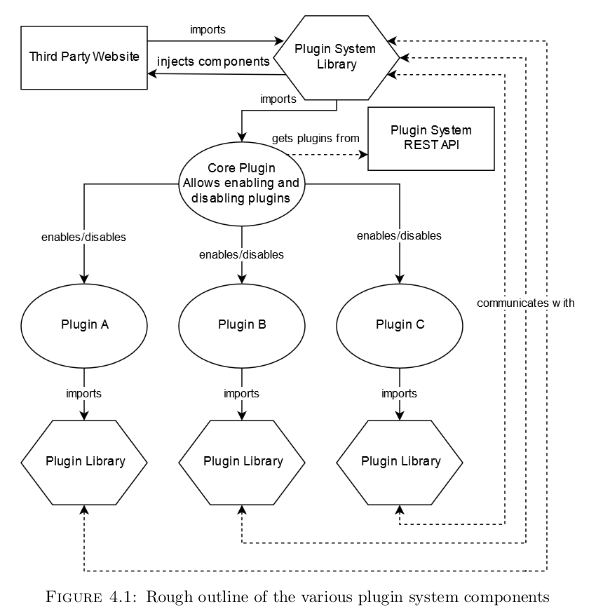
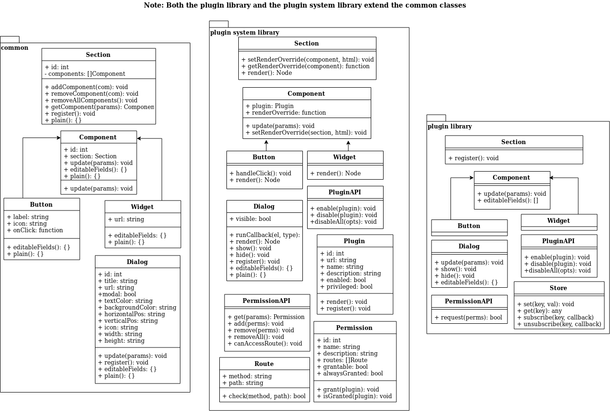

# Pluggy
This is a plugin system I made for my FYP.

There are 4 folders:
- cdn.plugin.ovh - This contains the plugin system SDK, which gets built as 2 separate files:
   - plugin.js - Plugins import this file. It uses postMessage to communicate with the parent website.
   - operator.js - Included on the parent website, it handles any messages and sends data plugin <-> website.
  The above design using postMessage mitigates the possibility of XSS occurring while allowing some customisation.
  One feature worth mentioning is a [plug.fetchInternal()](cdn.plugin.ovh/src/js/plugin/fetchInternal.js) function which lets plugins execute window.fetch() on the parent site and receive the response using postMessage, while allowing the parent site to only whitelist certain URLs or methods, allowing for OAuth-like behaviour.
- plugin-directory - This is a basic plugin store in which one can upload plugins, log in and out and enable/disable them on their website.
- plugin-api - This has a REST API which handles the various operations on the plugin-directory.
   **Sample plugins are in the 'plugins' folder**, plugin [#29](plugin-api/plugins/29) is the most interesting in my view, allowing exporting boards on Trello or Projects, depending on which site it's ran on.
- shane.ovh - A test site which imports the plugin system, for testing purposes

An outline of its design is here

UML

[Sample plugin (#29 previously mentioned)](plugin-api/plugins/29)

[FYP Report](tmp/report.pdf) - Contains filler