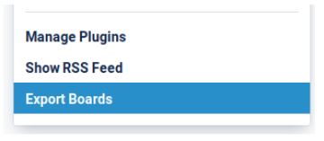
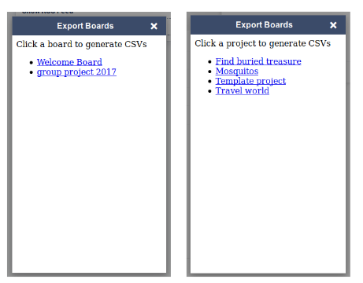
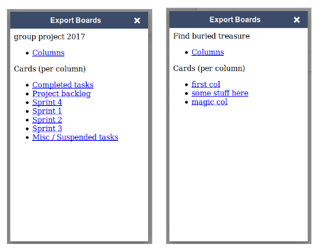
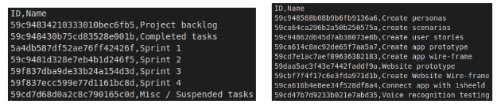

This adds a button to Projects / Trello

When clicked, it opens a dialog in the corner of the browser.

The dialog shows either a list of Trello boards or Projects projects depending on the site it's ran on.
If one clicks on an option, the screen changes where one can select all columns or a specific column to export.

Example Trello CSVs

